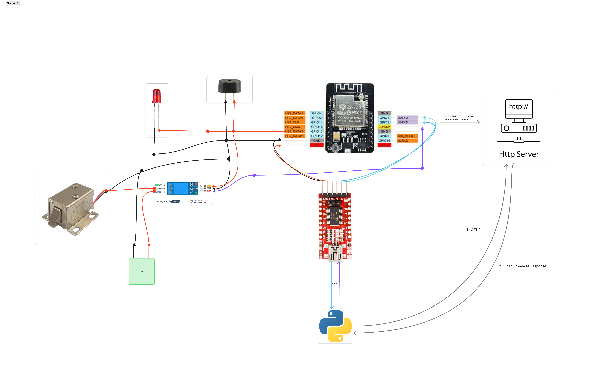

# ESP32-CAM Smart Door Lock System 

A smart, AI-powered door lock system built using **ESP32-CAM**.  
The device automatically unlocks the door when a **known face** is detected and sends a **Telegram alert** with a captured image when an unknown person appears.

---

## Project Preview

---

## Features

- **Face Detection & Recognition** using ESP32-CAM and Python
- **Automatic Door Unlock** for authorized individuals  
- **Unknown Face → Send Alert** to Telegram  
- Solenoid door-lock control  

---

## Hardware Requirements

- ESP32-CAM
- FTDI Programmer
- Solenoid Lock
- Jumper Wires
- 5V Power Supply
- 12V Power supply

## License

This project is open-source under the **MIT License**.

## Contributing

Contributions are welcome! If you have suggestions, bug reports, or improvements, feel free to open an issue or submit a pull request.

## Support My Work

If you find my work useful, consider supporting me by buying me a coffee!

